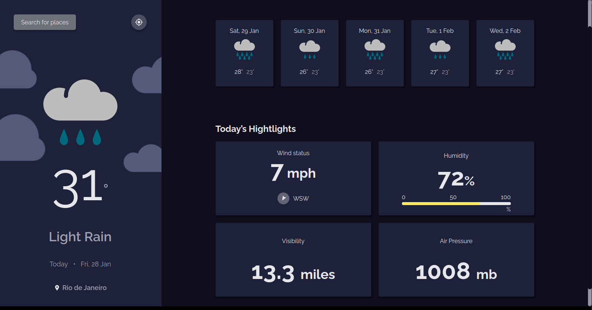

## Weather Api

[Check out the live site](https://weather-api-nicolasdev.vercel.app/)

<h4 align="center">
 Local and long range weather forecasts.
</h4>



## Tecnologies

This project was developed using cutting edge front-end technologies.

- [ReactJS](https://reactjs.org/)
- [Styled Components](https://styled-components.com/)
- [Meta Weather API](https://www.metaweather.com/)

## 💻 Getting started

### Requirements

- You need to install both [Node.js](https://nodejs.org/en/download/) and [Yarn](https://yarnpkg.com/) to run this project.

**Clone the project and access the folder**

```bash
$ git clone https://github.com/nicolasbarcellos/disneyplus-clone && cd disneyplus-clone
```

**Follow the steps below**

```bash
# Install the dependencies
$ yarn

# Run the web server
$ yarn start
```

The app will be available for access on your browser at `http://localhost:3000`

## 📝 License

This project is licensed under the MIT License - see the [LICENSE](LICENSE) file for details.

---

Made with 💜 by Nicolas Barcellos 👋 [Check out my LinkedIn](https://www.linkedin.com/in/nicolas-barcellos-868b341ab/)
